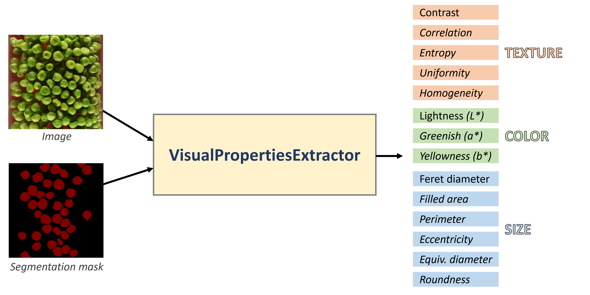

# `VisualPropertiesExtractor` Documentation

## Table of Contents

* [Overview](#overview)
* [Key Features](#key-features)
* [Getting Started](#getting-started)
* [Constructor](#constructor)
* [Arguments](#arguments)
* [Calibration System](#calibration-system)
* [Output Dataset](#output-dataset)
* [Practice Examples](#practice-examples)
* [License](#license)
* [Author](#author)

---

## Overview

**VisualPropertiesExtractor** is a comprehensive utility for extracting **size**, **shape**, **color**, and **texture** features from segmented objects in RGB images using their associated masks. Designed for image-based machine learning tasks such as **object tracking**, **quality inspection**, and **digital twin modeling**, it enables:

* Extraction of object-level visual descriptors
* Group-wise aggregation over time (e.g., drying intervals)
* Optional calibration of color and size metrics

It integrates seamlessly with TensorFlow pipelines and works alongside the companion utility 
<a href="https://github.com/anthony-iheonye/image-mask_dataset_builder">ImageAndMaskDatasetBuilder</a> 
for efficient preprocessing.


---

## Key Features

* Region-based property extraction using `scikit-image`
* Textural analysis via grey-level co-occurrence matrices (GLCM)
* Conversion from RGB to Lab color space
* Calibration of color (Lab) and size metrics via rational models
* Grouping and aggregation of visual metrics by time intervals
* JSON and CSV output for further analysis or ML ingestion

---

## Getting Started

### Prerequisites

* Python 3.10+
* pip ≥ 23.3.1

### a. Clone the Repository

```bash
git clone https://github.com/anthony-iheonye/visual-properties-extractor.git
cd visual-properties-extractor
```

### b. Set Up Environment

```bash
python3 -m venv vpe_venv
source vpe_venv/bin/activate
pip install --upgrade pip
pip install -r requirements.txt
```

---

## Constructor

```python
VisualPropertiesExtractor(
    start_image_index: int,
    images_directory: str,
    masks_directory: str,
    image_mask_channels: Tuple[int, int],
    exclude_partial_objects: bool = False,
    cache_visual_attributes: bool = False,
    calibrator: VisualPropertiesCalibrator = None,
    image_group_size: int = 1,
    interval_per_image_group: int = 15,
    initial_group_interval: int = 0,
    save_location: str = None,
    overwrite_existing_record: bool = True,
    realtime_update: bool = False,
    image_cache_directory: Optional[str] = None,
)
```

---

## Arguments

| Argument                    | Type                         | Description                                                                       |
|-----------------------------|------------------------------|-----------------------------------------------------------------------------------|
| `start_image_index`         | `int`                        | Index of the first image; used for naming outputs like `img_5`, `img_6`, etc.     |
| `images_directory`          | `str`                        | Directory containing the input RGB images.                                        |
| `masks_directory`           | `str`                        | Directory containing corresponding masks.                                         |
| `image_mask_channels`       | `Tuple[int, int]`            | Tuple specifying number of channels in image and mask (e.g., `(3, 1)`).           |
| `exclude_partial_objects`   | `bool`                       | Whether to exclude objects touching the border of the image.                      |
| `cache_visual_attributes`   | `bool`                       | Enable caching of computed region properties.                                     |
| `calibrator`                | `VisualPropertiesCalibrator` | Object for calibrating color and size from pixel to real-world values.            |
| `image_group_size`          | `int`                        | Number of images per group for computing time-based averages.                     |
| `interval_per_image_group`  | `int`                        | Time step (in minutes or seconds) between groups.                                 |
| `initial_group_interval`    | `int`                        | Starting time value for grouping intervals.                                       |
| `save_location`             | `str`, optional              | Directory where JSON/CSV outputs are saved. If `None`, results are not persisted. |
| `overwrite_existing_record` | `bool`                       | Whether to overwrite saved files at `save_location`.                              |
| `realtime_update`           | `bool`                       | If `True`, updates JSON/CSV incrementally as images are processed.                |
| `image_cache_directory`     | `str`, optional              | Directory for caching image-mask pairs during preprocessing.                      |

---
## Class Attributes
| Attribute Name           | Description                                                                                     |
|--------------------------|-------------------------------------------------------------------------------------------------|
| `image_mask_dataset`     | A TensorFlow dataset of `(image, mask)` pairs used for processing visual attributes.            |
| `comprehensive_props_df` | Pandas DataFrame containing object-wise visual properties for all images.                       |
| `mean_props_df`          | Pandas DataFrame with mean visual properties per image.                                         |
| `grouped_props_df`       | Pandas DataFrame with group-wise averaged visual properties across time intervals (if enabled). |
| `capture_interval`       | Time interval between image groups for time-labeled analysis.                                   |

---

## Calibration System

When `VisualPropertiesExtractor` is supplied a `VisualPropertiesCalibrator` object, it automatically calibrates both color and size features:

* **Color Calibration**: Converts camera-measured Lab values (L\*, a\*, b\*) to colorimeter-equivalent values using a rational polynomial model.
* **Size Calibration**: Converts pixel-based measurements (e.g., area, perimeter, equivalent diameter) to metric units like mm² or mm.

### Calibration Parameters

The calibrator receives its configuration through a `CalibrationParameters` object that encapsulates the coefficients for:

* Color calibration (L\*, a\*, b\*)
* Size scaling (area, diameter, perimeter)

### Example Parameters:

```python
realtime_parameters = CalibrationParameters(
    l_index={
        'a': -5.04461047576763E+06,
        'b': 5.13323641056063E+05,
        'c': 1.15843677123398E+04,
        'd': -7.50471807730221E+01
    },
    a_index={
        'a': -4.37022874993402E+00,
        'b': 7.66127417312916E-01,
        'c': 5.72699875489546E-03,
        'd': -1.01255846619522E-04
    },
    b_index={
        'a': -1.15950594393709E+01,
        'b': 7.12135024826324E-01,
        'c': -2.46027845221479E-03,
        'd': -2.19862222769195E-05
    },
    size_factor={
        'area': 0.00312,       # pixel^2 to mm^2
        'diameter': 0.05583,   # pixels to mm
        'perimeter': 0.05617   # pixels to mm
    }
)
```

These parameter objects are passed into `VisualPropertiesCalibrator`, which in turn is passed to `VisualPropertiesExtractor`:

```python
calibrator = VisualPropertiesCalibrator(calibration_parameters=realtime_parameters)
extractor = VisualPropertiesExtractor(..., calibrator=calibrator)
```

This setup was used in a real-world machine learning project to predict the **color, size, and texture evolution of green peas** during fluidized bed drying. Visual features were extracted from both real-time images captured inside the dryer and offline images sampled externally.

---

## Output Dataset

After running `.process_data()`, results are stored as:

* `comprehensive_visual_properties.json/csv`: Full object-wise dataset per image
* `mean_visual_properties.json/csv`: Mean visual attributes per image
* `visual_props_per_time_interval.json/csv`: Grouped averages by drying interval (if grouping enabled)

---

## Practice Examples

Explore a real-world use case in the provided [Jupyter notebook](notebooks/extract_visual_attributes.ipynb):

### **Exercise: Extract Ground Truth Visual Attributes from Segmented Images**

Learn how to use `VisualPropertiesExtractor` to compute calibrated object-level visual features from segmented RGB images of green peas undergoing fluidized bed drying.

The notebook walks you through:

* Real-time and offline image processing
* Calibration using two domain-specific calibrators - `realtime_calibrator` and `offline_calibrator`
* Grouping and time-based visual summaries (e.g., 10 images per 15-minute interval)
* Extracting and previewing:

  * Mean visual attributes per image
  * Object-level properties
  * Group-wise aggregated summaries


#### Example Snippet:
```python
from app.services.visual_attributes import VisualPropertiesExtractor, realtime_calibrator

image_dir = 'assets/realtime/images'
mask_dir = 'assets/realtime/masks'
save_dir = 'assets/realtime/visual_attributes'

extractor = VisualPropertiesExtractor(
    start_image_index=1,
    images_directory=image_dir,
    masks_directory=mask_dir,
    image_mask_channels=(3, 1),
    calibrator=realtime_calibrator,
    image_group_size=10,
    interval_per_image_group=15,
    save_location=save_dir,
)

extractor.process_data()
```

For the full example, visit the [Jupyter notebook](notebooks/extract_visual_attributes.ipynb). 

## License

This project is licensed under the MIT License.

---

## Author

Developed by [Anthony Iheonye](https://github.com/anthony-iheonye) | [LinkedIn](https://www.linkedin.com/in/anthony-iheonye)
